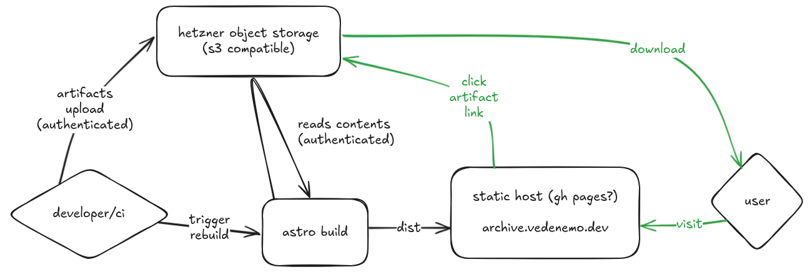

# Ghaf Archive



## Building

During the build step, the object storage credentials must be available in the environment as `AWS_ACCESS_KEY_ID` and `AWS_SECRET_ACCESS_KEY`.

```sh
npm run build
```

## S3 Client

Minio-client is used to upload artifacts into the object storage. First add alias:

```sh
mc alias set hetzner https://hel1.your-objectstorage.com $AWS_ACCESS_KEY_ID $AWS_SECRET_ACCESS_KEY
```

Then you can copy over the artifacts:

```sh
mc cp aarch64-linux.nvidia-jetson-orin-agx-debug.tar hetzner/ghaf-artifacts/ghaf-XX-XX/
# or an entire directory at once
mc cp -r ./ghaf-XX-XX/ hetzner/ghaf-artifacts/ghaf-XX-XX/
```

## Commands

All commands are run from the root of the project, from a terminal:

| Command                   | Action                                           |
| :------------------------ | :----------------------------------------------- |
| `npm install`             | Installs dependencies                            |
| `npm run dev`             | Starts local dev server at `localhost:4321`      |
| `npm run build`           | Build your production site to `./dist/`          |
| `npm run preview`         | Preview your build locally, before deploying     |
| `npm run astro ...`       | Run CLI commands like `astro add`, `astro check` |
| `npm run astro -- --help` | Get help using the Astro CLI                     |
